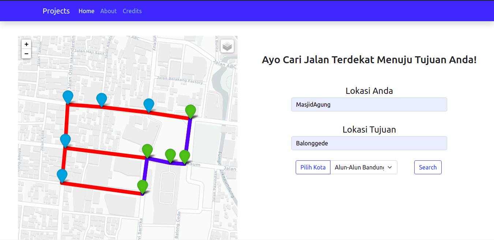

# Tugas Kecil 3 IF2122 Strategi Algoritma
> Implementasi Algoritma A* untuk Menentukan Lintasan Terpendek

## Table of contents
* [General info](#general-info)
* [Screenshots](#screenshots)
* [Technologies](#technologies)
* [Setup](#setup)
* [Features](#features)
* [Status](#status)
* [Inspiration](#inspiration)
* [Contact](#contact)

## General info
Algoritma A* (atau A star) dapat digunakan untuk menentukan lintasan terpendek dari suatu titik
ke titik lain. Pada tugas kecil 3 ini, anda diminta menentukan lintasan terpendek berdasarakan peta
Google Map jalan-jalan di kota Bandung. Dari ruas-ruas jalan di peta dibentuk graf. Simpul
menyatakan persilangan jalan atau ujung jalan. Asumsikan jalan dapat dilalui dari dua arah. Bobot
graf menyatakan jarak (m atau km) antar simpul. Jarak antar dua simpul dapat dihitung dari
koordinat kedua simpul menggunakan rumus jarak Euclidean

## Screenshots



## Technologies
* HTML 5
* CSS
* Boostrap 5
* Python 3 (minimal 3.8 version)

## Setup
1. Install Flask di terminal dengan mengetikkan
```bash
pip install flask
```
&nbsp;&nbsp;&nbsp;&nbsp;atau dengan

```bash
python3 -m pip install flask
```
2. Install Folium di terminal dengan mengetikkan
```bash
pip install folium
```
&nbsp;&nbsp;&nbsp;&nbsp;atau dengan

```bash
python3 -m pip install folium
```

3. Lakukan git clone repository ini dengan mengetikkan di terminal atau git bash
```bash
git clone https://github.com/widyaput/Tucil3STIMA.git
```

## Code Examples
Show examples of usage:
1. Masuk ke folder hasil clone git repository
2. Arahkan direktori ke src
3. Jalankan 'Backend.py" di terminal
4. Copy link local yang tersedia di terminal pada browser

## Features
List of features ready and TODOs for future development
* Visualisasi Map API
* Click Node dan Path untuk mendapatkan informasi lanjut
* Visualisai Warna Node dan Path yang memudahkan pembacaan map
* Alert Exception jika salah dalam menginput node/tidak ditemukan jalan/tidak memilih kota
* Interactive GUI Website :
1. Link Navigation bar (navigasi bar bisa di klik dan terdapat transisi yang smooth)
2. Dinamic Button
3. Combobox map & Round Form Input

## Status
Project is: _finished_

## Inspiration
https://informatika.stei.itb.ac.id/~rinaldi.munir/Stmik/2020-2021/Tugas-Kecil-3-(2021).pdf

## Contact
Created by Muhammad Fahmi Alamsyah - feel free to contact me!
Created by Widya Anugrah Putra - feel free to contact me!
